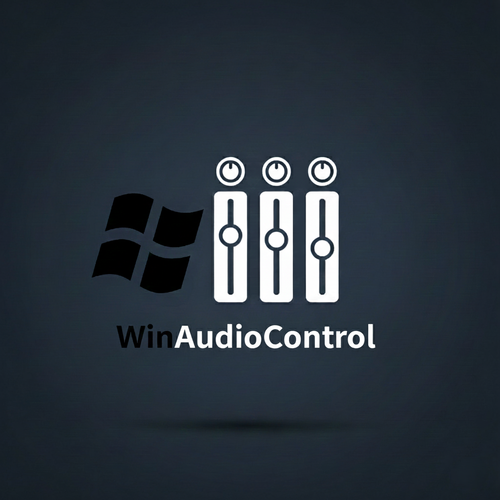
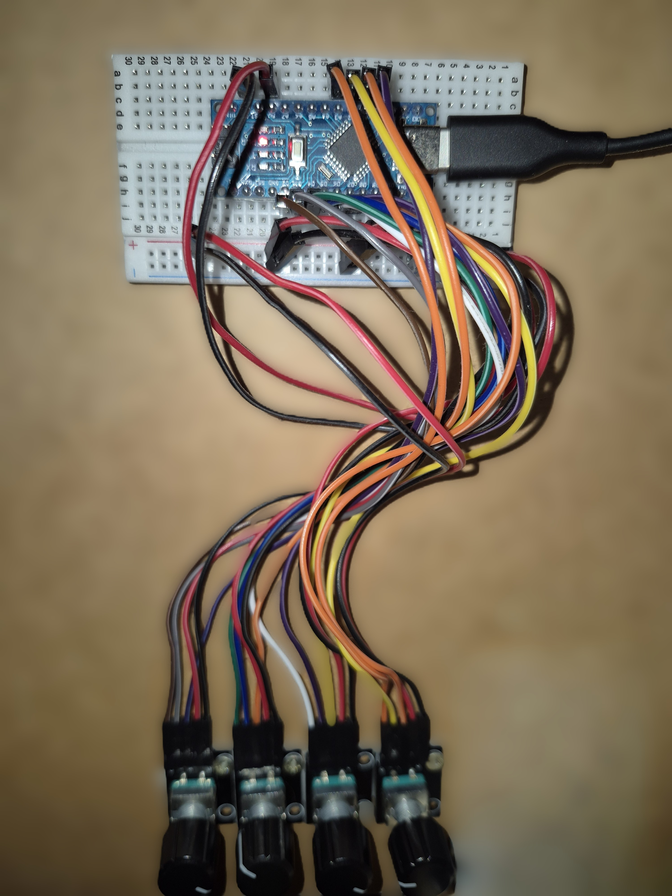

# Windows Audio Control

Control your Windows master, app-specific, and foreground process volumes with your own microcontroller and rotary encoders.

## ✨ Features
- **Channel Mixing**: Control Master, specific Apps, and the currently focused window.
- **Mute Function**: Push the encoder to toggle mute for the assigned channel.
- **Intelligent Foreground Control**: Automatically targets the active window's volume, but stays locked to the last audio-producing app until a new, unmapped sound source is detected.
- **EarTrumpet Integration**: Triggers the EarTrumpet flyout for visual feedback.
- **Auto-Reconnect**: Automatically restores connection if the Arduino is unplugged.

## 🚀 Installation & Setup
1. **Hardware:** Connect your rotary encoders to the microcontroller.

  
   
  <em>Current prototype setup on a breadboard</em>

2. **Firmware:** Upload your version of the `sketch_dec17b.ino` from the `/sketch_dec17b` folder to the microcontroller. Ensure the pin assignments match your wiring.
3. **Configuration:** Before running the `.exe` or `audio-control.py` make sure to edit the `config.json`:
   - Set the `com_port` (If left empty, the first device that uses a COM port will be used.).
   - Configure your channels using these options:

| Channel Option | Description |
| :--- | :--- |
| **master** | Adjusts the global Windows system volume. |
| **foreground** | Adjusts the volume of the application currently in focus. |
| **app.exe** | Adjusts the volume of a specific app (e.g., `spotify.exe`). |

   - `flyout_hotkey`: Must match your EarTrumpet "Settings > Shortcuts" hotkey.

4. **Autostart (Optional):** Create a shortcut of the `.exe` and place it in the Windows Startup folder (`shell:startup`) to launch it automatically on boot.
5. **Run:** Start `audio-control.exe` or run `python audio-control.py`.
